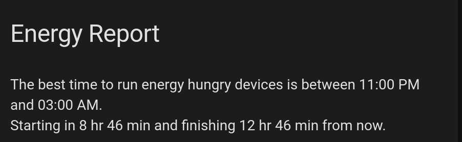
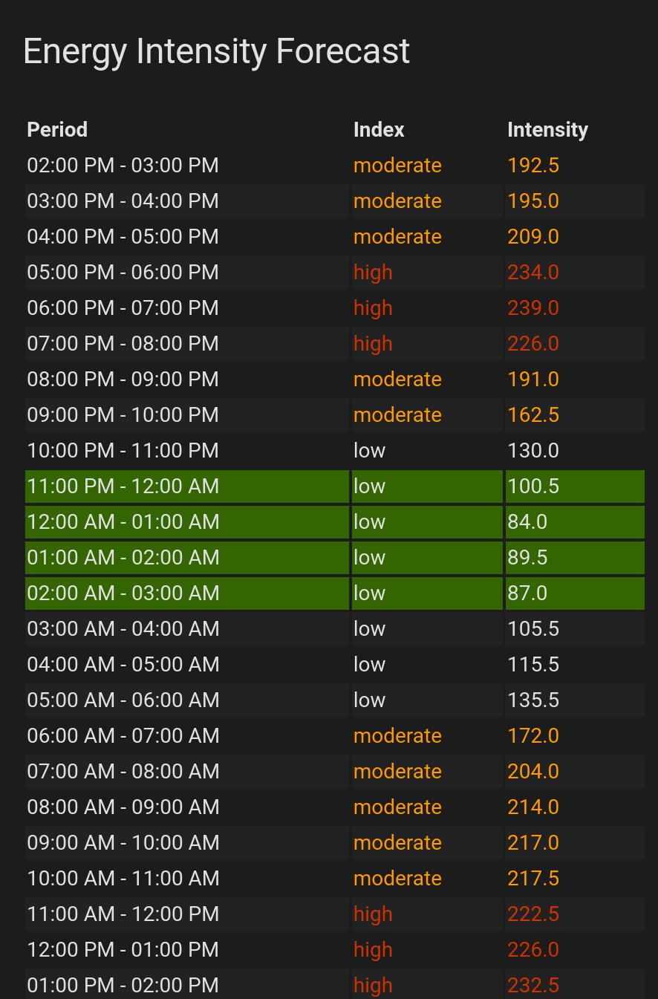
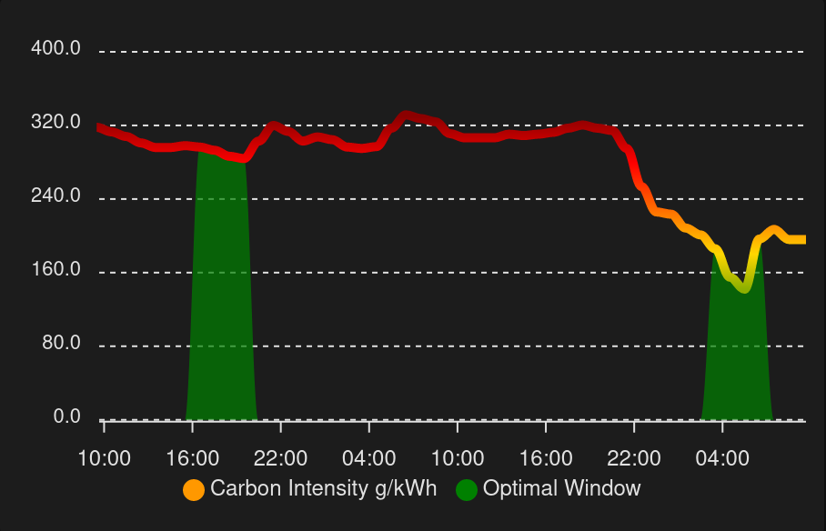

# Carbon Intensity UK sensor

[![GitHub Release][releases-shield]][releases]

[![GitHub Activity][commits-shield]][commits]
[![License][license-shield]](LICENSE)

[![hacs][hacsbadge]][hacs]
![Project Maintenance][maintenance-shield]
[![BuyMeCoffee][buymecoffeebadge]][buymecoffee]

[![Discord][discord-shield]][discord]
[![Community Forum][forum-shield]][forum]

_Component to integrate with [Carbon Intensity UK][carbon_intensity_uk]._

**This component will set up the following platforms.**

Platform | Description
-- | --
`sensor` | Show info from Carbon Intensity UK API.

The sensor retrieves information using [Carbon Intensity UK API library](https://github.com/jscruz/carbonintensity)

![alt Sensor attributes][attributesimg]

## Installation

1. Using the tool of choice open the directory (folder) for your HA configuration (where you find `configuration.yaml`).
2. If you do not have a `custom_components` directory (folder) there, you need to create it.
3. In the `custom_components` directory (folder) create a new folder called `carbon_intensity_uk`.
4. Download _all_ the files from the `custom_components/carbon_intensity_uk/` directory (folder) in this repository.
5. Place the files you downloaded in the new directory (folder) you created.
6. Restart Home Assistant
7. In the HA UI go to "Configuration" -> "Integrations" click "+" and search for "Carbon Intensity UK"

Using your HA configuration directory (folder) as a starting point you should now also have this:

```text
custom_components/carbon_intensity_uk/.translations/en.json
custom_components/carbon_intensity_uk/.translations/nb.json
custom_components/carbon_intensity_uk/.translations/sensor.nb.json
custom_components/carbon_intensity_uk/__init__.py
custom_components/carbon_intensity_uk/binary_sensor.py
custom_components/carbon_intensity_uk/config_flow.py
custom_components/carbon_intensity_uk/const.py
custom_components/carbon_intensity_uk/manifest.json
custom_components/carbon_intensity_uk/sensor.py
custom_components/carbon_intensity_uk/switch.py
```

## Example Markdown card



```




The best time to run energy hungry devices is between {{ as_timestamp(state_attr('sensor.carbon_intensity_uk','optimal_window_from')) | timestamp_custom('%I:%M %p')  }} and {{ as_timestamp(state_attr('sensor.carbon_intensity_uk','optimal_window_to')) | timestamp_custom('%I:%M %p')  }}.
Starting in {{ t_start | timestamp_custom('%-H hr %-M min' if t_start > 3600 else '%-M min', false) }} and finishing {{ t_end | timestamp_custom('%-H hr %-M min' if t_end > 3600 else '%-M min', false) }} from now.

```

## Display forecast in html card



```
type: custom:html-template-card
title: Energy Intensity Forecast
ignore_line_breaks: true
content: >
  <style> table {    width: 100%;   } tr:nth-child(even) {     background-color:
  #222222;   } td, th {     text-align: left;   } </style>  <table> <thead> <tr>
  <th>Period</th> <th>Index</th>  <th>Intensity</th> </tr></thead> <tbody>    <tr
    style="background-color:#336600;">
    <td> {{ as_timestamp(state.from) | timestamp_custom('%I:%M %p') }} - {{ as_timestamp(state.to) | timestamp_custom('%I:%M %p')}}</td>
    <td  style="color:#cc3300"
     style="color:#ff9900" >  {{state.index}}</td>
    <td  style="color:#cc3300"
     style="color:#ff9900" >  {{state.intensity}}</td>
  </tr>     </tbody> </table> 
```

## Display forecast in html card



```
type: custom:apexcharts-card
experimental:
  color_threshold: true
graph_span: 2d
span:
  start: minute
update_interval: 1min
series:
  - entity: sensor.carbon_intensity_uk
    unit: g/kWh
    name: Carbon Intensity g/kWh
    show:
      legend_value: false
    data_generator: |
      return entity.attributes.forecast.map(obj => {
        return [new Date(obj.from).getTime(), obj.intensity];
      });
    color_threshold:
      - value: 25
        color: darkgreen
        opacity: 1
      - value: 95
        color: green
      - value: 180
        color: gold
      - value: 279
        color: red
      - value: 330
        color: darkred
  - entity: sensor.carbon_intensity_uk
    type: area
    unit: g/kWh
    color: green
    name: Optimal Window
    stroke_width: 0
    show:
      legend_value: false
    data_generator: |
      return entity.attributes.forecast.map(obj => {
        return [new Date(obj.from).getTime(), (obj.optimal ? obj.intensity : 0 )];
      });
```


## Configuration is done in the UI

<!---->

## Contributions are welcome!

If you want to contribute to this please read the [Contribution guidelines](CONTRIBUTING.md)

***

[carbon_intensity_uk]: https://github.com/jscruz/sensor.carbon_intensity_uk
[buymecoffee]: https://www.buymeacoffee.com/jscruz
[buymecoffeebadge]: https://img.shields.io/badge/buy%20me%20a%20coffee-donate-yellow.svg?style=for-the-badge
[commits-shield]: https://img.shields.io/github/commit-activity/y/jscruz/sensor.carbon_intensity_uk?style=for-the-badge
[commits]: https://github.com/jscruz/sensor.carbon_intensity_uk/commits/master
[hacs]: https://github.com/custom-components/hacs
[hacsbadge]: https://img.shields.io/badge/HACS-Custom-orange.svg?style=for-the-badge
[discord]: https://discord.gg/Qa5fW2R
[discord-shield]: https://img.shields.io/discord/330944238910963714.svg?style=for-the-badge
[attributesimg]: attributes.png
[forum-shield]: https://img.shields.io/badge/community-forum-brightgreen.svg?style=for-the-badge
[forum]: https://community.home-assistant.io/
[license-shield]: https://img.shields.io/github/license/jscruz/sensor.carbon_intensity_uk.svg?style=for-the-badge
[maintenance-shield]: https://img.shields.io/badge/maintainer-Jorge%20Cruz%20%40jscruz-blue.svg?style=for-the-badge
[releases-shield]: https://img.shields.io/github/release/jscruz/sensor.carbon_intensity_uk.svg?style=for-the-badge
[releases]: https://github.com/jscruz/sensor.carbon_intensity_uk/releases
